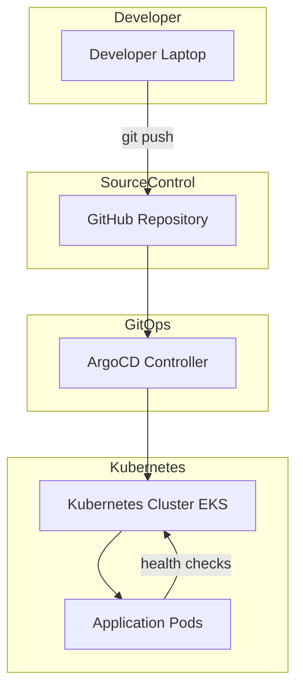

# EKS GitOps Platform

A production-style **GitOps-based Kubernetes platform** built on **Amazon EKS** using **ArgoCD** for automated deployments and continuous reconciliation.

This project demonstrates how modern **DevOps and Site Reliability Engineering (SRE)** teams manage Kubernetes workloads using **Git as the single source of truth**.

---

# Platform Overview

The platform implements a **GitOps workflow** where application deployments and infrastructure configurations are stored in Git repositories and automatically applied to the Kubernetes cluster.

Key principles used:

- Declarative infrastructure
- Continuous reconciliation
- Automated deployments
- Self-healing systems
- Infrastructure as Code

---

# Architecture

Deployment flow:

1. Developer pushes application code to GitHub
2. Kubernetes manifests are updated in Git
3. ArgoCD continuously monitors the repository
4. ArgoCD synchronizes cluster state with Git
5. Kubernetes deploys or updates the application
6. Health checks ensure application reliability

---

# Architecture Diagram



---

# Repository Structure

```
eks-gitops-platform
│
├── apps
│   └── sample-api
│       ├── main.py
│       ├── Dockerfile
│       └── requirements.txt
│
├── gitops
│   └── apps/sample-api
│       ├── deployment.yaml
│       ├── service.yaml
│       ├── kustomization.yaml
│       └── argocd-app.yaml
│
├── terraform
│   └── Infrastructure provisioning
│
├── observability
│   └── Monitoring integrations
│
├── runbooks
│   └── Operational procedures
│
├── security
│   └── Security policies
│
├── docs
│   └── architecture.md
│
└── kind-config.yaml
```

---

# Key Features

### GitOps Continuous Delivery

- ArgoCD monitors Git repositories
- Automatically synchronizes Kubernetes manifests
- Eliminates manual deployment steps

---

### Kubernetes Workload Deployment

- Containerized Python API
- Managed through Kubernetes manifests
- Supports rolling updates

---

### Self-Healing Infrastructure

- Kubernetes automatically replaces failed pods
- Desired state continuously enforced via GitOps

---

### Infrastructure as Code

Terraform can be used to provision:

- EKS cluster
- Networking resources
- IAM policies

---

# Technology Stack

| Category      | Tools                |
| ------------- | -------------------- |
| Cloud         | AWS EKS              |
| GitOps        | ArgoCD               |
| Containers    | Docker               |
| Orchestration | Kubernetes           |
| IaC           | Terraform            |
| Language      | Python               |
| Observability | Prometheus / Grafana |

---

# Deployment Workflow

```
Developer → GitHub → ArgoCD → Kubernetes → Application
```

1. Build container image
2. Push image to container registry
3. Update Kubernetes manifests
4. ArgoCD detects changes
5. Cluster automatically reconciles

---

# Getting Started

Clone the repository:

```
git clone https://github.com/ParasBhanderi/eks-gitops-platform.git
cd eks-gitops-platform
```

Build the container:

```
docker build -t sample-api ./apps/sample-api
```

Deploy to Kubernetes:

```
kubectl apply -f gitops/apps/sample-api
```

---

# SRE Practices Implemented

This project demonstrates key **Site Reliability Engineering principles**:

- GitOps-based deployments
- Declarative infrastructure management
- Automated reconciliation
- Kubernetes self-healing
- Infrastructure as Code
- Observability-ready architecture

---

# Future Improvements

- CI/CD pipelines using GitHub Actions
- Prometheus and Grafana monitoring
- Distributed tracing
- SLO and Error Budget policies
- Canary deployments

---

# Author

Paras Bhanderi  
SRE / DevOps Engineer

GitHub: https://github.com/ParasBhanderi
